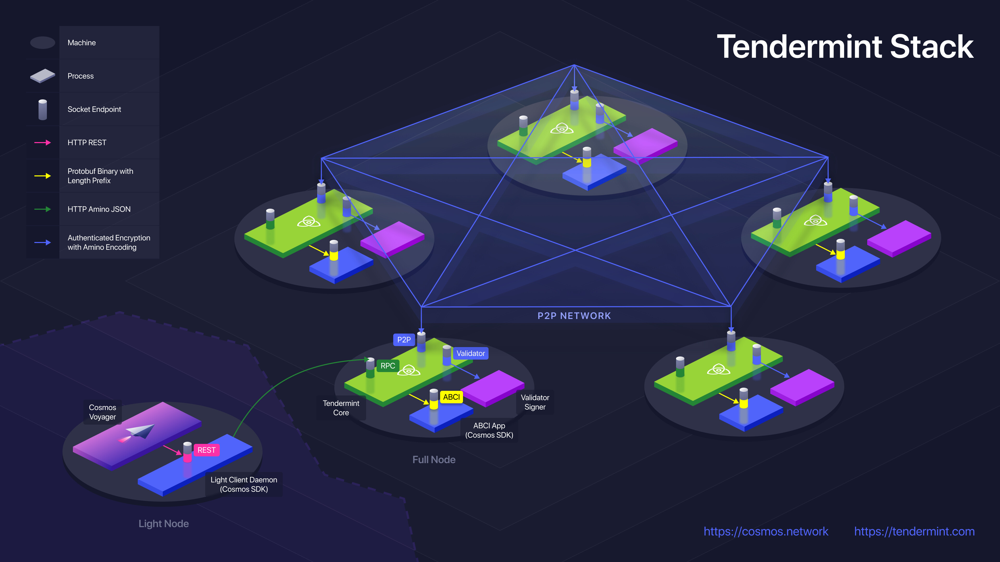

# 应用架构指南

在这里，我们提供了一个关于 Tendermint 区块链应用程序推荐架构的简要指南。

下面的图表提供了一个绝佳的示例：

我们在这里区分了两种形式的 "应用程序"。第一种是最终用户应用程序，比如用户下载的基于桌面的钱包应用程序，这是用户实际与系统进行交互的地方。另一种是 ABCI 应用程序，它是实际在区块链上运行的逻辑。最终用户应用程序发送的交易在被 Tendermint 共识提交后，最终由 ABCI 应用程序处理。

在这个图表中，最终用户应用程序是位于底部左侧的 [Lunie](https://lunie.io/) 应用程序。Lunie 通过暴露的 REST API 与应用程序进行通信。应用程序通过 Tendermint Core RPC 与 Tendermint 节点进行通信并验证 Tendermint 轻客户端证明。Tendermint Core 进程与本地的 ABCI 应用程序进行通信，实际处理用户的查询或交易。

ABCI 应用程序必须是 Tendermint 共识的确定性结果 - 任何未经 Tendermint 传递的对应用程序状态的外部影响都可能导致共识失败。因此，**除了通过 ABCI，任何东西都不应该与 ABCI 应用程序进行通信**。

如果 ABCI 应用程序是用 Go 编写的，可以将其编译成 Tendermint 二进制文件。否则，它应该使用 Unix 套接字与 Tendermint 进行通信。如果需要使用 TCP，必须额外注意加密和认证连接。

所有对 ABCI 应用程序的读取都通过 Tendermint 的 `/abci_query` 端点进行。所有对 ABCI 应用程序的写入都通过 Tendermint 的 `/broadcast_tx_*` 端点进行。

轻客户端守护进程是为轻客户端（最终用户）提供几乎与完整节点相同的安全性的组件。它格式化和广播交易，并验证查询和交易结果的证明。请注意，它不一定是一个守护进程 - 轻客户端逻辑也可以在最终用户应用程序的同一进程中实现。

对于那些安全要求较低的ABCI应用程序，轻客户端守护进程的功能可以移入ABCI应用程序进程本身。然而，需要极度谨慎地将ABCI应用程序进程暴露给除Tendermint之外的任何东西，因为所有的交易，以及可能的所有查询，仍然应通过Tendermint进行。

请参阅以下更详细的文档：

- [轻客户端REST API的跨链标准](https://github.com/cosmos/cosmos-sdk/pull/1028)
- [Tendermint RPC文档](https://docs.tendermint.com/v0.34/rpc/)
- [在生产环境中使用Tendermint](../tendermint-core/running-in-production.md)
- [ABCI规范](https://github.com/tendermint/spec/tree/95cf253b6df623066ff7cd4074a94e7a3f147c7a/spec/abci)

---
order: 3
---

# Application Architecture Guide

Here we provide a brief guide on the recommended architecture of a
Tendermint blockchain application.

The following diagram provides a superb example:

We distinguish here between two forms of "application". The first is the
end-user application, like a desktop-based wallet app that a user downloads,
which is where the user actually interacts with the system. The other is the
ABCI application, which is the logic that actually runs on the blockchain.
Transactions sent by an end-user application are ultimately processed by the ABCI
application after being committed by the Tendermint consensus.

The end-user application in this diagram is the [Lunie](https://lunie.io/) app, located at the bottom
left. Lunie communicates with a REST API exposed by the application.
The application with Tendermint nodes and verifies Tendermint light-client proofs
through the Tendermint Core RPC. The Tendermint Core process communicates with
a local ABCI application, where the user query or transaction is actually
processed.

The ABCI application must be a deterministic result of the Tendermint
consensus - any external influence on the application state that didn't
come through Tendermint could cause a consensus failure. Thus _nothing_
should communicate with the ABCI application except Tendermint via ABCI.

If the ABCI application is written in Go, it can be compiled into the
Tendermint binary. Otherwise, it should use a unix socket to communicate
with Tendermint. If it's necessary to use TCP, extra care must be taken
to encrypt and authenticate the connection.

All reads from the ABCI application happen through the Tendermint `/abci_query`
endpoint. All writes to the ABCI application happen through the Tendermint
`/broadcast_tx_*` endpoints.

The Light-Client Daemon is what provides light clients (end users) with
nearly all the security of a full node. It formats and broadcasts
transactions, and verifies proofs of queries and transaction results.
Note that it need not be a daemon - the Light-Client logic could instead
be implemented in the same process as the end-user application.

Note for those ABCI applications with weaker security requirements, the
functionality of the Light-Client Daemon can be moved into the ABCI
application process itself. That said, exposing the ABCI application process
to anything besides Tendermint over ABCI requires extreme caution, as
all transactions, and possibly all queries, should still pass through
Tendermint.

See the following for more extensive documentation:

- [Interchain Standard for the Light-Client REST API](https://github.com/cosmos/cosmos-sdk/pull/1028)
- [Tendermint RPC Docs](https://docs.tendermint.com/v0.34/rpc/)
- [Tendermint in Production](../tendermint-core/running-in-production.md)
- [ABCI spec](https://github.com/tendermint/spec/tree/95cf253b6df623066ff7cd4074a94e7a3f147c7a/spec/abci)
