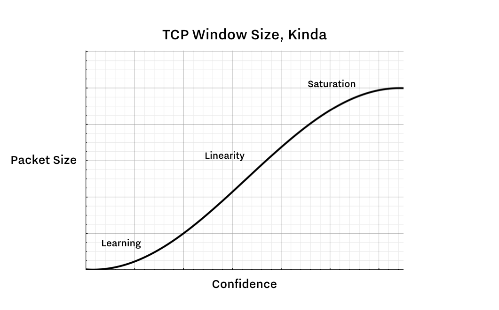

# Tendermint 架构概述


> **2019年11月**

在接下来的几周里，@brapse、@marbar3778和我(@tessr)将进行一系列会议，讨论 Tendermint Core 的架构。这些是我从这些会议中记录的笔记，它们要么作为为未来的工程师入职提供的文档，要么作为这样一个文档的基础。

## 通信

Tendermint Core 中有三种形式的通信（例如请求、响应、连接）：*节点间通信*、*节点内通信* 和 *客户端通信*。

- 节点间通信：发生在节点和其他节点之间。这种通信通过 TCP 或 HTTP 进行。下面会详细介绍。
- 节点内通信：发生在节点内部（即在反应器或其他组件之间）。通常是函数或方法调用，或者偶尔通过事件总线进行。
- 客户端通信：发生在客户端（如钱包或浏览器）与网络中的节点之间。

### 节点间通信

节点间通信可以通过两种方式进行：

1. 通过 p2p 包进行的 TCP 连接
    - 最常见的节点间通信形式
    - 节点之间的连接是持久的，并在反应器之间共享，由 switch 进行管理（下面会详细介绍 switch）。
2. 通过 HTTP 进行的 RPC
    - 用于短暂的、一次性的请求
    - 例如：反应器特定的状态，如高度
    - 还可以通过连接到通道的 WebSockets 进行通知（如新的交易）

### P2P 业务（Switch、PEX 和地址簿）

在编写 p2p 服务时，有两个主要的职责：

1. 路由：谁接收哪些消息？
2. 对等点管理：你可以与谁交流？他们的状态是什么？如何进行对等点发现？

第一个职责由 Switch 处理：

- 负责在对等点之间路由连接
- 特别注意，它**仅处理 TCP 连接**；RPC/HTTP 是分开的
- 是每个反应器的依赖项；所有反应器都公开一个名为 `setSwitch` 的函数
- 保持通道（TCP 连接上的通道，而不是 Go 通道）并使用它们进行路由
- 是一个全局对象，具有全局命名空间用于消息
- 与 libp2p 具有类似的功能

TODO：关于Switch实现的更多信息（也许）。

第二个职责由PEX和地址簿的组合处理。

TODO：PEX和地址簿是什么？

#### TCP的性质和`mconnection`的介绍

以下是关于TCP的一些相关事实：

1. 所有TCP连接都有一个“帧窗口大小”，它表示“信心”的数据包大小；也就是说，如果您正在沿着一个新的连接发送数据包，您必须从小数据包开始。随着数据包的成功接收，您可以开始发送越来越大的数据包。（下图显示了这个曲线。）这意味着TCP连接启动较慢。
2. syn/ack过程也意味着小而频繁的消息有很高的开销。
3. 套接字由文件描述符表示。



为了在Tendermint创建的条件下拥有高性能的TCP连接，我们创建了`mconnection`，即多路复用连接。它是我们自己在TCP之上构建的协议。它允许我们重用TCP连接以最小化开销，并通过在必要时发送辅助消息来保持窗口大小高。

`mconnection`由一个结构体表示，其中包含一批消息、读写缓冲区和通道ID到反应器的映射。它通过文件描述符与TCP通信，可以向其写入数据。每个对等连接都有一个`mconnection`。

`mconnection`有两个方法：`send`，它接受一个原始套接字句柄并将数据写入；和`trySend`，它将数据写入不同的缓冲区。（TODO：是哪个缓冲区？）

`mconnection`由一个对等体拥有，该对等体（可能与许多其他对等体一起）由（全局）传输拥有，该传输由（全局）Switch拥有：

<!-- markdownlint-disable -->
```
switch
 transport
  peer
   mconnection
  peer
   mconnection
  peer
   mconnection
```
<!-- markdownlint-restore -->

## node.go

node.go是运行节点的入口点。它设置反应器，设置Switch，并为节点注册所有RPC端点。

## 节点类型

1. 验证节点：
2. 全节点：
3. 种子节点：

TODO：详细说明不同类型的节点及其配置之间的差异。

## Reactors（反应器）

以下是一些反应器的事实：

- 每个反应器都持有一个指向全局开关的指针（通过 `SetSwitch()` 设置）
- 开关持有指向每个反应器的指针（通过 `addReactor()` 添加）
- 每个反应器在 `node.go` 中进行设置（如果您使用自定义反应器，则在此处指定）
- `addReactor` 由开关调用；`addReactor` 为该反应器调用 `setSwitch`
- 假设所有反应器都在之前添加
- 有时，反应器通过从开关获取对彼此的引用来相互通信（开关维护对每个反应器的指针）。**问题：反应器还能以其他方式相互通信吗？**

此外，所有反应器都公开：

1. 一个 TCP 通道
2. 一个 `receive` 方法
3. 一个 `addReactor` 调用

`receive` 方法可以被 mconnection 调用多次。它在所有反应器中具有相同的签名。

`addReactor` 调用通过反应器上的所有通道进行循环，并创建一个通道 ID 到反应器的映射。开关保留此映射，并将其传递给 _transport_，它是 TCP 连接的一个薄包装器。

以下是一个详尽（？）的反应器列表：

- 区块链反应器
- 共识反应器
- 证据反应器
- 内存池反应器
- PEX 反应器

稍后将详细讨论每个反应器。


### 区块链反应器

区块链反应器有两个职责：

1. 根据同行的请求提供区块
2. TODO：了解区块链反应器的第二个职责


---
order: false
---
# Tendermint Architectural Overview


> **November 2019**

Over the next few weeks, @brapse, @marbar3778 and I (@tessr) are having a series of meetings to go over the architecture of Tendermint Core. These are my notes from these meetings, which will either serve as an artifact for onboarding future engineers; or will provide the basis for such a document.

## Communication

There are three forms of communication (e.g., requests, responses, connections) that can happen in Tendermint Core: *internode communication*, *intranode communication*, and *client communication*.

- Internode communication: Happens between a node and other peers. This kind of communication happens over TCP or HTTP. More on this below.
- Intranode communication: Happens within the node itself (i.e., between reactors or other components). These are typically function or method calls, or occasionally happen through an event bus.

- Client communication: Happens between a client (like a wallet or a browser) and a node on the network.

### Internode Communication

Internode communication can happen in two ways:

1. TCP connections through the p2p package
    - Most common form of internode communication
    - Connections between nodes are persisted and shared across reactors, facilitated by the switch. (More on the switch below.)
2. RPC over HTTP
    - Reserved for short-lived, one-off requests
    - Example: reactor-specific state, like height
    - Also possible: web-sockets connected to channels for notifications (like new transactions)

### P2P Business (the Switch, the PEX, and the Address Book)

When writing a p2p service, there are two primary responsibilities:

1. Routing: Who gets which messages?
2. Peer management: Who can you talk to? What is their state? And how can you do peer discovery?

The first responsibility is handled by the Switch:

- Responsible for routing connections between peers
- Notably _only handles TCP connections_; RPC/HTTP is separate
- Is a dependency for every reactor; all reactors expose a function `setSwitch`
- Holds onto channels (channels on the TCP connection--NOT Go channels) and uses them to route
- Is a global object, with a global namespace for messages
- Similar functionality to libp2p

TODO: More information (maybe) on the implementation of the Switch.

The second responsibility is handled by a combination of the PEX and the Address Book.

 TODO: What is the PEX and the Address Book?

#### The Nature of TCP, and Introduction to the `mconnection`

Here are some relevant facts about TCP:

1. All TCP connections have a "frame window size" which represents the packet size to the "confidence;" i.e., if you are sending packets along a new connection, you must start out with small packets. As the packets are received successfully, you can start to send larger and larger packets. (This curve is illustrated below.) This means that TCP connections are slow to spin up.
2. The syn/ack process also means that there's a high overhead for small, frequent messages 
3. Sockets are represented by file descriptors.


In order to have performant TCP connections under the conditions  created in Tendermint, we've created the `mconnection`, or the multiplexing connection. It is our own protocol built on top of TCP. It lets us reuse TCP connections to minimize overhead, and it keeps the window size high by sending auxiliary messages when necessary.

The `mconnection` is represented by a struct, which contains a batch of messages, read and write buffers, and a map of channel IDs to reactors. It communicates with TCP via file descriptors, which it can write to. There is one `mconnection` per peer connection.

The `mconnection` has two methods: `send`, which takes a raw handle to the socket and writes to it; and `trySend`, which writes to a different buffer. (TODO: which buffer?)

The `mconnection` is owned by a peer, which is owned (potentially with many other peers) by a (global) transport, which is owned by the (global) switch:

<!-- markdownlint-disable -->
```
switch
 transport
  peer
   mconnection
  peer
   mconnection
  peer
   mconnection
```
<!-- markdownlint-restore -->

## node.go

node.go is the entrypoint for running a node. It sets up reactors, sets up the switch, and registers all the RPC endpoints for a node.

## Types of Nodes


1. Validator Node:
2. Full Node:
3. Seed Node:

TODO: Flesh out the differences between the types of nodes and how they're configured.

## Reactors

Here are some Reactor Facts:

- Every reactor holds a pointer to the global switch (set through `SetSwitch()`)
- The switch holds a pointer to every reactor (`addReactor()`)
- Every reactor gets set up in node.go (and if you are using custom reactors, this is where you specify that)
- `addReactor` is called by the switch; `addReactor` calls `setSwitch` for that reactor
- There's an assumption that all the reactors are added before
- Sometimes reactors talk to each other by fetching references to one another via the switch (which maintains a pointer to each reactor). **Question: Can reactors talk to each other in any other way?**

Furthermore, all reactors expose:

1. A TCP channel
2. A `receive` method
3. An `addReactor` call

The `receive` method can be called many times by the mconnection. It has the same signature across all reactors.

The `addReactor` call does a for loop over all the channels on the reactor and creates a map of channel IDs->reactors. The switch holds onto this map, and passes it to the _transport_, a thin wrapper around TCP connections.

The following is an exhaustive (?) list of reactors:

- Blockchain Reactor
- Consensus Reactor
- Evidence Reactor
- Mempool Reactor
- PEX Reactor

Each of these will be discussed in more detail later.


### Blockchain Reactor

The blockchain reactor has two responsibilities:

1. Serve blocks at the request of peers
2. TODO: learn about the second responsibility of the blockchain reactor
