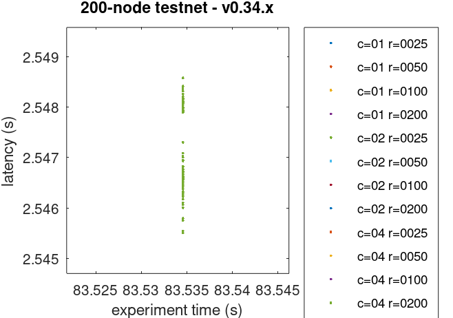
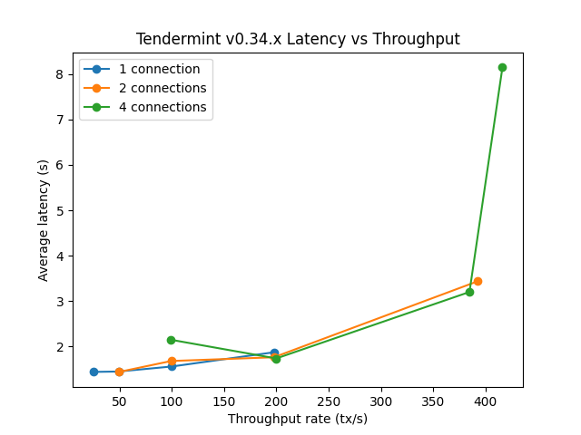
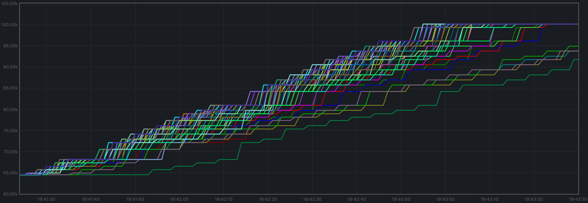

# v0.34.x

## 200 节点测试网络

### 寻找饱和点

在检查测试结果时，首要目标是确定饱和点。
饱和点是一个设置，其事务负载足够大，以至于无法使测试网络保持稳定：负载运行器试图产生的事务数量略多于测试网络能够处理的数量。

下表总结了 v0.34.x 的结果，针对不同的实验（从文件 [`v034_report_tabbed.txt`](./img/v034_report_tabbed.txt) 中提取）。

这个表的 X 轴是 `c`，即负载运行器进程与目标节点之间创建的连接数。
这个表的 Y 轴是 `r`，即每秒发出的事务数量或速率。

|        |  c=1  |  c=2  |  c=4  |
| :---   | ----: | ----: | ----: |
| r=25   |  2225 | 4450  | 8900  |
| r=50   |  4450 | 8900  | 17800 |
| r=100  |  8900 | 17800 | 35600 |
| r=200  | 17800 | 35600 | 38660 |

该表显示了负载运行器生成的长度为 1024 字节的事务数量，以及 Tendermint 在实验持续时间的 90 秒内处理的事务数量。
表中的每个单元格都对应于一个实验，其中负载运行器与所选验证器之间的 websocket 连接数（`c`）以及负载运行器试图生成的每秒事务数（`r`）。
请注意，工具试图生成的总负载等于 $c \cdot r$。

我们可以看到，饱和点位于跨越以下单元格的对角线之上：

* `r=200,c=2`
* `r=100,c=4`

鉴于总事务数量应接近速率、连接数和实验时间（89 秒，因为最后一批事务未发送）的乘积，
所有位于饱和对角线（`r=200,c=4`）之下的实验都有一个共同点，即处理的总事务数量明显少于 $c \cdot r \cdot 89$ 的乘积，
这是当系统能够很好地处理负载时预期的事务数量。
对于 `r=200,c=4`，我们得到了 38660，而理论上的事务数量应该是 $200 \cdot 4 \cdot 89 = 71200$。

在这个阶段，我们选择了一个接近饱和对角线的实验，以进一步研究这个版本的性能。
**选择的实验是 `r=200,c=2`**。

下图显示了 `r=200,c=2` 的负载运行器的 CPU 负载情况（平均值，每分钟输出 `top`），
我们可以看到大部分时间负载都接近于 0。

### 检查延迟

[这里](../method.md) 描述的方法允许我们绘制所有实验的交易延迟。

正如我们所看到的，即使是超过饱和对角线的实验也能够保持交易延迟稳定（即不会持续增加）。
我们的解释是，Tendermint 内部的争用通过 WebSockets 传播到负载运行器，
因此负载运行器无法产生目标负载，而只能产生其中的一部分。

对 Prometheus 数据的进一步检查（见下文）显示，交易池在稳定状态下包含了许多交易，
但没有快速增长并迅速返回到这个稳定状态。这表明交易能够至少以提交到交易池的速度被 Tendermint 网络处理。
最后，测试脚本确保在实验结束时交易池为空，以便处理所有提交到链上的交易。

最后，绘图中的点的数量似乎比预期的要少得多，尤其是接近或超过饱和对角线的地方。
这是绘图的视觉效果；在绘图中看起来像是点的地方实际上可能是巨大的点簇。
为了证实这一点，我们通过设置（精心选择的）微小的轴间隔来放大上面的图。
下面显示的点簇在上面的图中看起来像是一个单独的点。

延迟的绘图可以作为与其他版本进行比较的基准。

下图总结了不同数量的WebSocket连接到节点的平均延迟与总吞吐量之间的关系，这些连接用于加载交易。

### 选择的实验的Prometheus指标

如上所述[（参见上文）](#finding-the-saturation-point)，选择的实验是`r=200,c=2`。本节进一步从Prometheus数据中提取了该实验的关键指标。

#### 内存池大小

内存池大小是内存池中交易数量的计数，对于所有完整节点来说是稳定且均匀的，没有出现任何不受限制的增长。下图显示了在给定时间内所有完整节点内的累积交易数量随时间的演变。可以观察到的两个峰值对应于某些节点在初始轮次之后继续进行共识的时期。

下图显示了所有完整节点的平均值的演变，其在1500到2000个未完成交易之间波动。

观察到的峰值与某些节点在共识的初始轮次之后继续进行共识的时刻相一致（见下文）。

#### 对等节点

所有节点的对等节点数量保持稳定。种子节点的对等节点数量较高（约为140），而其他节点的对等节点数量较低（在21到74之间）。非种子节点达到50个以上的对等节点是由于＃9548。

#### 每个高度的共识轮次

大多数高度只需要一轮，但某些节点需要在某个时刻前进到第1轮。

#### 每分钟产生的区块数，每分钟处理的交易数

每分钟产生的区块数是此图的斜率。

在2分钟的时间内，高度从530增加到569。这导致每分钟平均产生19.5个区块。

每分钟处理的交易数是此图的斜率。

在2分钟的时间段内，总交易量从64525增加到100125，每分钟平均处理17800笔交易。然而，从图表中我们可以看到，在两分钟之前，所有交易都已经被处理完毕。如果我们调整交易处理的时间窗口（大约105秒），我们可以得到每分钟20343笔交易。

#### 内存驻留集大小

下图显示了所有监控进程的驻留集大小。

所有进程的平均值在1.2 GiB左右波动，并没有显示出不受限制的增长。

#### CPU利用率

在Unix机器上，用于衡量CPU利用率的最佳指标是`load1`，通常在[`top`的输出](https://www.digitalocean.com/community/tutorials/load-average-in-linux)中出现。

它在大多数情况下都保持在5以下，这通常被认为是可接受的负载。

### 测试结果

**结果：N/A**（v0.34.x是基准）

日期：2022-10-14

版本：3ec6e424d6ae4c96867c2dcf8310572156068bb6

## 旋转节点测试网络

对于这个测试网络，我们将使用一个负载，可以安全地认为它在这个测试网络的规模（13到38个完整节点）下处于饱和点以下：`c=4,r=800`。

注意：用于这些测试的Tendermint版本受到#9539的影响。然而，达到mempool的减少负载与我们在这里关注的功能是正交的。

### 延迟

下图显示了所有延迟的图表。

我们可以观察到在测试结束时存在一些非常高的延迟。怀疑它们是重复的交易，我们检查了延迟的原始文件，并发现有超过100K个重复的交易。

下图显示了已删除所有重复交易的延迟文件，即只保留了重复交易的第一次出现。

这个问题在 `v0.34.x` 版本中存在，可能需要解决，可能的解决方法与我们在运行200个节点的高负载测试时所采取的方法相同：增加 `cache_size` 配置参数。

### Prometheus指标

这里显示的指标集比200个节点实验少。我们只关注那些可能会受到追赶过程（blocksync）影响的指标。

#### 每分钟的区块和交易数

与200个节点测试一样，每分钟产生的区块是这个图的斜率。

在5229秒的时间段内，高度从2增加到3638。这导致平均每分钟产生41个区块。

下面的图只显示了临时节点报告的高度（也包括在上面的图中）。请注意，_height_ 指标只在节点切换到共识后才显示，因此在节点被杀死、清除、从头开始和追赶时会出现间隙。

每分钟处理的交易是这个图的斜率。

我们周期性地看到靠近 `y=0` 的小线是临时节点在追赶时开始处理的交易。

在5229分钟的时间段内，总交易量从0增加到387697个交易，平均每分钟处理4449个交易。我们可以看到图的斜率出现了一些突变。这需要进行调查。

#### 节点

下面的图显示了实验过程中节点数量的变化。观察到的周期性变化是由于临时节点的停止、清除和重新创建引起的。

验证节点的图形集中在图的较高部分，而临时节点主要集中在较低部分。

#### 内存常驻集大小

所有进程的平均常驻集大小（RSS）似乎是稳定的，并且在末尾略微增长。这可能与上面观察到的交易负载增加有关。

验证人和临时节点（当它们处于活动状态时）所占用的内存是可比较的。

#### CPU利用率

该图显示了所有节点的`load1`指标。

它大部分时间都保持在5以下，这被认为是正常负载。
紫色线条遵循不同的模式，它是验证人通过RPC从负载运行器进程接收所有交易。

### 测试结果

**结果：N/A**

日期：2022-10-10

版本：a28c987f5a604ff66b515dd415270063e6fb069d

---
order: 1
parent:
  title: Tendermint Quality Assurance Results for v0.34.x
  description: This is a report on the results obtained when running v0.34.x on testnets
  order: 2
---

# v0.34.x

## 200 Node Testnet

### Finding the Saturation Point

The first goal when examining the results of the tests is identifying the saturation point.
The saturation point is a setup with a transaction load big enough to prevent the testnet
from being stable: the load runner tries to produce slightly more transactions than can
be processed by the testnet.

The following table summarizes the results for v0.34.x, for the different experiments
(extracted from file [`v034_report_tabbed.txt`](./img/v034_report_tabbed.txt)).

The X axis of this table is `c`, the number of connections created by the load runner process to the target node.
The Y axis of this table is `r`, the rate or number of transactions issued per second.

|        |  c=1  |  c=2  |  c=4  |
| :---   | ----: | ----: | ----: |
| r=25   |  2225 | 4450  | 8900  |
| r=50   |  4450 | 8900  | 17800 |
| r=100  |  8900 | 17800 | 35600 |
| r=200  | 17800 | 35600 | 38660 |

The table shows the number of 1024-byte-long transactions that were produced by the load runner,
and processed by Tendermint, during the 90 seconds of the experiment's duration.
Each cell in the table refers to an experiment with a particular number of websocket connections (`c`)
to a chosen validator, and the number of transactions per second that the load runner
tries to produce (`r`). Note that the overall load that the tool attempts to generate is $c \cdot r$.

We can see that the saturation point is beyond the diagonal that spans cells

* `r=200,c=2`
* `r=100,c=4`

given that the total transactions should be close to the product of the rate, the number of connections,
and the experiment time (89 seconds, since the last batch never gets sent).

All experiments below the saturation diagonal (`r=200,c=4`) have in common that the total
number of transactions processed is noticeably less than the product $c \cdot r \cdot 89$,
which is the expected number of transactions when the system is able to deal well with the
load.
With `r=200,c=4`, we obtained 38660 whereas the theoretical number of transactions should
have been $200 \cdot 4 \cdot 89 = 71200$.

At this point, we chose an experiment at the limit of the saturation diagonal,
in order to further study the performance of this release.
**The chosen experiment is `r=200,c=2`**.

This is a plot of the CPU load (average over 1 minute, as output by `top`) of the load runner for `r=200,c=2`,
where we can see that the load stays close to 0 most of the time.

### Examining latencies

The method described [here](../method.md) allows us to plot the latencies of transactions
for all experiments.

As we can see, even the experiments beyond the saturation diagonal managed to keep
transaction latency stable (i.e. not constantly increasing).
Our interpretation for this is that contention within Tendermint was propagated,
via the websockets, to the load runner,
hence the load runner could not produce the target load, but a fraction of it.

Further examination of the Prometheus data (see below), showed that the mempool contained many transactions
at steady state, but did not grow much without quickly returning to this steady state. This demonstrates
that the transactions were able to be processed by the Tendermint network at least as quickly as they
were submitted to the mempool. Finally, the test script made sure that, at the end of an experiment, the
mempool was empty so that all transactions submitted to the chain were processed.

Finally, the number of points present in the plot appears to be much less than expected given the
number of transactions in each experiment, particularly close to or above the saturation diagonal.
This is a visual effect of the plot; what appear to be points in the plot are actually potentially huge
clusters of points. To corroborate this, we have zoomed in the plot above by setting (carefully chosen)
tiny axis intervals. The cluster shown below looks like a single point in the plot above.

The plot of latencies can we used as a baseline to compare with other releases.

The following plot summarizes average latencies versus overall throughputs
across different numbers of WebSocket connections to the node into which
transactions are being loaded.

### Prometheus Metrics on the Chosen Experiment

As mentioned [above](#finding-the-saturation-point), the chosen experiment is `r=200,c=2`.
This section further examines key metrics for this experiment extracted from Prometheus data.

#### Mempool Size

The mempool size, a count of the number of transactions in the mempool, was shown to be stable and homogeneous
at all full nodes. It did not exhibit any unconstrained growth.
The plot below shows the evolution over time of the cumulative number of transactions inside all full nodes' mempools
at a given time.
The two spikes that can be observed correspond to a period where consensus instances proceeded beyond the initial round
at some nodes.

The plot below shows evolution of the average over all full nodes, which oscillates between 1500 and 2000
outstanding transactions.

The peaks observed coincide with the moments when some nodes proceeded beyond the initial round of consensus (see below).

#### Peers

The number of peers was stable at all nodes.
It was higher for the seed nodes (around 140) than for the rest (between 21 and 74).
The fact that non-seed nodes reach more than 50 peers is due to #9548.

#### Consensus Rounds per Height

Most heights took just one round, but some nodes needed to advance to round 1 at some point.

#### Blocks Produced per Minute, Transactions Processed per Minute

The blocks produced per minute are the slope of this plot.

Over a period of 2 minutes, the height goes from 530 to 569.
This results in an average of 19.5 blocks produced per minute.

The transactions processed per minute are the slope of this plot.

Over a period of 2 minutes, the total goes from 64525 to 100125 transactions,
resulting in 17800 transactions per minute. However, we can see in the plot that
all transactions in the load are processed long before the two minutes.
If we adjust the time window when transactions are processed (approx. 105 seconds),
we obtain 20343 transactions per minute.

#### Memory Resident Set Size

Resident Set Size of all monitored processes is plotted below.

The average over all processes oscillates around 1.2 GiB and does not demonstrate unconstrained growth.

#### CPU utilization

The best metric from Prometheus to gauge CPU utilization in a Unix machine is `load1`,
as it usually appears in the
[output of `top`](https://www.digitalocean.com/community/tutorials/load-average-in-linux).

It is contained in most cases below 5, which is generally considered acceptable load.

### Test Result

**Result: N/A** (v0.34.x is the baseline)

Date: 2022-10-14

Version: 3ec6e424d6ae4c96867c2dcf8310572156068bb6

## Rotating Node Testnet

For this testnet, we will use a load that can safely be considered below the saturation
point for the size of this testnet (between 13 and 38 full nodes): `c=4,r=800`.

N.B.: The version of Tendermint used for these tests is affected by #9539.
However, the reduced load that reaches the mempools is orthogonal to functionality
we are focusing on here.

### Latencies

The plot of all latencies can be seen in the following plot.

We can observe there are some very high latencies, towards the end of the test.
Upon suspicion that they are duplicate transactions, we examined the latencies
raw file and discovered there are more than 100K duplicate transactions.

The following plot shows the latencies file where all duplicate transactions have
been removed, i.e., only the first occurrence of a duplicate transaction is kept.

This problem, existing in `v0.34.x`, will need to be addressed, perhaps in the same way
we addressed it when running the 200 node test with high loads: increasing the `cache_size`
configuration parameter.

### Prometheus Metrics

The set of metrics shown here are less than for the 200 node experiment.
We are only interested in those for which the catch-up process (blocksync) may have an impact.

#### Blocks and Transactions per minute

Just as shown for the 200 node test, the blocks produced per minute are the gradient of this plot.

Over a period of 5229 seconds, the height goes from 2 to 3638.
This results in an average of 41 blocks produced per minute.

The following plot shows only the heights reported by ephemeral nodes
(which are also included in the plot above). Note that the _height_ metric
is only showed _once the node has switched to consensus_, hence the gaps
when nodes are killed, wiped out, started from scratch, and catching up.

The transactions processed per minute are the gradient of this plot.

The small lines we see periodically close to `y=0` are the transactions that
ephemeral nodes start processing when they are caught up.

Over a period of 5229 minutes, the total goes from 0 to 387697 transactions,
resulting in 4449 transactions per minute. We can see some abrupt changes in
the plot's gradient. This will need to be investigated.

#### Peers

The plot below shows the evolution in peers throughout the experiment.
The periodic changes observed are due to the ephemeral nodes being stopped,
wiped out, and recreated.

The validators' plots are concentrated at the higher part of the graph, whereas the ephemeral nodes
are mostly at the lower part.

#### Memory Resident Set Size

The average Resident Set Size (RSS) over all processes seems stable, and slightly growing toward the end.
This might be related to the increased in transaction load observed above.

The memory taken by the validators and the ephemeral nodes (when they are up) is comparable.

#### CPU utilization

The plot shows metric `load1` for all nodes.

It is contained under 5 most of the time, which is considered normal load.
The purple line, which follows a different pattern is the validator receiving all
transactions, via RPC, from the load runner process.

### Test Result

**Result: N/A**

Date: 2022-10-10

Version: a28c987f5a604ff66b515dd415270063e6fb069d
