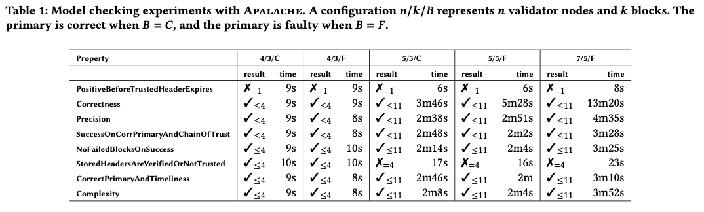

# 轻客户端规范

该目录包含轻客户端协议的正在进行的英文和 TLA+ 规范。轻客户端的实现可以在以下位置找到：
[Rust](https://github.com/informalsystems/tendermint-rs/tree/master/light-client) 和
[Go](https://github.com/tendermint/tendermint/tree/v0.34.x/light)。

轻客户端假定从可信源一次性初始化，包括可信的头部和验证人集合。然后，轻客户端协议允许客户端通过从全节点网络（至少一个正确的节点）请求和验证一小部分数据来安全地更新其可信状态。

轻客户端分解为两个主要组件：

- [提交验证](#提交验证) - 验证来自单个全节点（称为主节点）的签名头部和相关验证人集合的更改
- [攻击检测](#攻击检测) - 验证多个全节点（称为次节点）的提交，并检测冲突（即轻客户端攻击的存在）

如果检测到轻客户端攻击，轻客户端将向负责“问责”的全节点提交证据，即惩罚攻击者：

- [问责](#问责) - 根据攻击的证据，计算一组负责该攻击的验证人。

## 提交验证

[英文规范](verification/verification_001_published.md) 描述了轻客户端提交验证问题，涉及时间属性
[LCV-DIST-SAFE.1](https://github.com/informalsystems/tendermint-rs/blob/master/docs/spec/lightclient/verification/verification_001_published.md#lcv-dist-safe1) 和
[LCV-DIST-LIVE.1](https://github.com/informalsystems/tendermint-rs/blob/master/docs/spec/lightclient/verification/verification_001_published.md#lcv-dist-live1)。
提交验证假定在 Tendermint 失败模型下运行，其中在某个时间段内有 +2/3 的验证人是正确的，并且验证人集合在每个高度都可以任意更改。

还提供了一个轻客户端协议，其中包括对头部、提交和验证人集合进行的所有检查，以满足时间属性 - 因此轻客户端可以与区块链进行连续同步。客户端可以通过利用可信和不可信验证人集合之间的重叠来跳过可能的许多中间头部。当重叠不足时，可以使用二分法来找到提供所需重叠的最小一组头部。

[TLA+规范版本001](verification/Lightclient_A_1.tla)是对由客户端执行的提交验证协议的形式化描述，包括安全性和终止性，可以使用Apalache进行模型检查。

[轻客户端验证版本003](verification/Lightclient_003_draft.tla)的更详细的TLA+规范目前正在同行评审中。

`MC*.tla`文件包含了[TLA+规范](verification/Lightclient_A_1.tla)的具体参数，以便进行模型检查。例如，[MC4_3_faulty.tla](verification/MC4_3_faulty.tla)包含了以下参数：节点、高度、信任期、时钟漂移、主节点的正确性以及故障进程的比例：

```tla
AllNodes == {"n1", "n2", "n3", "n4"}
TRUSTED_HEIGHT == 1
TARGET_HEIGHT == 3
TRUSTING_PERIOD == 1400     \* the trusting period in some time units
CLOCK_DRIFT = 10            \* how much we assume the local clock is drifting
REAL_CLOCK_DRIFT = 3        \* how much the local clock is actually drifting
IS_PRIMARY_CORRECT == FALSE
FAULTY_RATIO == <<1, 3>>    \* < 1 / 3 faulty validators
```

要运行一组完整的实验，请将[apalache](https://github.com/informalsystems/apalache)和[apalache-tests](https://github.com/informalsystems/apalache-tests)克隆到目录`$DIR`中，并运行以下命令：

```sh
$DIR/apalache-tests/scripts/mk-run.py --memlimit 28 002bmc-apalache-ok.csv $DIR/apalache . out
./out/run-all.sh
```

实验完成后，可以通过执行以下命令来收集日志：

```sh
cd ./out
$DIR/apalache-tests/scripts/parse-logs.py --human .
```

`results.csv`中的所有行都应报告`Deadlock`，这意味着算法已终止且未发现不变式违规。

与[002bmc-apalache-ok.csv](verification/002bmc-apalache-ok.csv)类似，文件[003bmc-apalache-error.csv](verification/003bmc-apalache-error.csv)指定了应产生反例的实验集合：

```sh
$DIR/apalache-tests/scripts/mk-run.py --memlimit 28 003bmc-apalache-error.csv $DIR/apalache . out
./out/run-all.sh
```

`results.csv`中的所有行都应报告`Error`。

下表总结了轻客户端验证版本001的实验结果。TLA+属性可以在[TLA+规范](verification/Lightclient_A_1.tla)中找到。
实验在配备32GB RAM和4核Intel® Xeon® CPU E5-2686 v4 @ 2.30GHz CPU的AWS实例上运行。
当深度为k时，如果报告了错误，则我们写“✗=k”，如果在深度k之前没有报告错误，则写“✓<=k”。



版本003的实验结果将被添加。

## 攻击检测

[英文规范](detection/detection_003_reviewed.md)定义了轻客户端攻击（以及它们与区块链分叉的区别），
并描述了轻客户端通过与全节点网络通信来检测这些攻击的问题，其中至少有一个节点是正确的。

规范还包含一个检测协议，该协议检查通过验证协议从主节点获取的头部是否与由次要节点提供的相应头部匹配。
如果不匹配，协议会分析涉及的全节点的验证跟踪，并生成可以提交给全节点的[misbehavior的证据](detection/detection_003_reviewed.md#tmbc-lc-evidence-data1)，
以便对有问题的验证者进行惩罚。

[TLA+规范](detection/LCDetector_003_draft.tla)是对两个对等体的检测协议的形式化描述，包括安全性和终止性，可以使用Apalache进行模型检查。

`LCD_MC*.tla`文件包含了[TLA+规范](detection/LCDetector_003_draft.tla)的具体参数，以便运行模型检查器。
例如，[LCD_MC4_4_faulty.tla](detection/MC4_4_faulty.tla)包含了节点、高度、信任期、时钟漂移、节点正确性和故障进程比例的以下参数：

```tla
AllNodes == {"n1", "n2", "n3", "n4"}
TRUSTED_HEIGHT == 1
TARGET_HEIGHT == 3
TRUSTING_PERIOD == 1400     \* the trusting period in some time units
CLOCK_DRIFT = 10            \* how much we assume the local clock is drifting
REAL_CLOCK_DRIFT = 3        \* how much the local clock is actually drifting
IS_PRIMARY_CORRECT == FALSE
IS_SECONDARY_CORRECT == FALSE
FAULTY_RATIO == <<1, 3>>    \* < 1 / 3 faulty validators
```

要运行一组完整的实验，请将 [apalache](https://github.com/informalsystems/apalache) 和 [apalache-tests](https://github.com/informalsystems/apalache-tests) 克隆到目录 `$DIR` 中，并运行以下命令：

```sh
$DIR/apalache-tests/scripts/mk-run.py --memlimit 28 004bmc-apalache-ok.csv $DIR/apalache . out
./out/run-all.sh
```

实验完成后，您可以通过执行以下命令来收集日志：

```sh
cd ./out
$DIR/apalache-tests/scripts/parse-logs.py --human .
```

`results.csv` 中的所有行都应报告 `Deadlock`，这意味着算法已终止且未发现任何不变式违规。

与 [004bmc-apalache-ok.csv](verification/004bmc-apalache-ok.csv) 类似，
文件 [005bmc-apalache-error.csv](verification/005bmc-apalache-error.csv) 指定了应导致反例的实验集合：

```sh
$DIR/apalache-tests/scripts/mk-run.py --memlimit 28 005bmc-apalache-error.csv $DIR/apalache . out
./out/run-all.sh
```

`results.csv` 中的所有行都应报告 `Error`。

详细的实验结果即将添加。

## 账户责任

[英文规范](attacks/isolate-attackers_002_reviewed.md)
定义了在接收到来自轻客户端的攻击 [证据](detection/detection_003_reviewed.md#tmbc-lc-evidence-data1) 后，在完整节点上执行的协议。特别是，该协议处理三种类型的攻击

- 疯狂的
- 撒谎
- 遗忘

我们在[最后一部分](attacks/isolate-attackers_002_reviewed.md#Part-III---Completeness)的英文规范中讨论了非疯狂案例是通过在冲突块中具有相同的验证器集来定义的。对于这些情况，对 [Tendermint Consensus in TLA+](./accountability/README.md) 的计算机辅助分析表明，撒谎和遗忘捕捉了所有非疯狂攻击。

[TLA+ 规范](attacks/Isolation_001_draft.tla)
是协议的正式描述，包括安全属性，可以使用 Apalache 进行模型检查。
```

与其他规范类似，[MC_5_3.tla](attacks/MC_5_3.tla) 包含了运行模型检查器所需的具体参数。该规范可以在几秒钟内完成检查。

[tendermint-accountability](./accountability/README.md)


---
order: 1
parent:
  title: Light Client
  order: 5
---

# Light Client Specification

This directory contains work-in-progress English and TLA+ specifications for the Light Client
protocol. Implementations of the light client can be found in
[Rust](https://github.com/informalsystems/tendermint-rs/tree/master/light-client) and
[Go](https://github.com/tendermint/tendermint/tree/v0.34.x/light).

Light clients are assumed to be initialized once from a trusted source
with a trusted header and validator set. The light client
protocol allows a client to then securely update its trusted state by requesting and
verifying a minimal set of data from a network of full nodes (at least one of which is correct).

The light client is decomposed into two main components:

- [Commit Verification](#Commit-Verification) - verify signed headers and associated validator
  set changes from a single full node, called primary
- [Attack Detection](#Attack-Detection) -  verify commits across multiple full nodes (called secondaries) and detect conflicts (ie. the existence of a lightclient attack)

In case a lightclient attack is detected, the lightclient submits evidence to a full node which is responsible for "accountability", that is, punishing attackers:

- [Accountability](#Accountability) - given evidence for an attack, compute a set of validators that are responsible for it.

## Commit Verification

The [English specification](verification/verification_001_published.md) describes the light client
commit verification problem in terms of the temporal properties
[LCV-DIST-SAFE.1](https://github.com/informalsystems/tendermint-rs/blob/master/docs/spec/lightclient/verification/verification_001_published.md#lcv-dist-safe1) and
[LCV-DIST-LIVE.1](https://github.com/informalsystems/tendermint-rs/blob/master/docs/spec/lightclient/verification/verification_001_published.md#lcv-dist-live1).
Commit verification is assumed to operate within the Tendermint Failure Model, where +2/3 of validators are correct for some time period and
validator sets can change arbitrarily at each height.

A light client protocol is also provided, including all checks that
need to be performed on headers, commits, and validator sets
to satisfy the temporal properties - so a light client can continuously
synchronize with a blockchain. Clients can skip possibly
many intermediate headers by exploiting overlap in trusted and untrusted validator sets.
When there is not enough overlap, a bisection routine can be used to find a
minimal set of headers that do provide the required overlap.

The [TLA+ specification ver. 001](verification/Lightclient_A_1.tla)
is a formal description of the
commit verification protocol executed by a client, including the safety and
termination, which can be model checked with Apalache.

A more detailed TLA+ specification of
[Light client verification ver. 003](verification/Lightclient_003_draft.tla)
is currently under peer review.

The `MC*.tla` files contain concrete parameters for the
[TLA+ specification](verification/Lightclient_A_1.tla), in order to do model checking.
For instance, [MC4_3_faulty.tla](verification/MC4_3_faulty.tla) contains the following parameters
for the nodes, heights, the trusting period, the clock drifts,
correctness of the primary node, and the ratio of the faulty processes:

```tla
AllNodes == {"n1", "n2", "n3", "n4"}
TRUSTED_HEIGHT == 1
TARGET_HEIGHT == 3
TRUSTING_PERIOD == 1400     \* the trusting period in some time units
CLOCK_DRIFT = 10            \* how much we assume the local clock is drifting
REAL_CLOCK_DRIFT = 3        \* how much the local clock is actually drifting
IS_PRIMARY_CORRECT == FALSE
FAULTY_RATIO == <<1, 3>>    \* < 1 / 3 faulty validators
```

To run a complete set of experiments, clone [apalache](https://github.com/informalsystems/apalache) and [apalache-tests](https://github.com/informalsystems/apalache-tests) into a directory `$DIR` and run the following commands:

```sh
$DIR/apalache-tests/scripts/mk-run.py --memlimit 28 002bmc-apalache-ok.csv $DIR/apalache . out
./out/run-all.sh
```

After the experiments have finished, you can collect the logs by executing the following command:

```sh
cd ./out
$DIR/apalache-tests/scripts/parse-logs.py --human .
```

All lines in `results.csv` should report `Deadlock`, which means that the algorithm
has terminated and no invariant violation was found.

Similar to [002bmc-apalache-ok.csv](verification/002bmc-apalache-ok.csv),
file [003bmc-apalache-error.csv](verification/003bmc-apalache-error.csv) specifies
the set of experiments that should result in counterexamples:

```sh
$DIR/apalache-tests/scripts/mk-run.py --memlimit 28 003bmc-apalache-error.csv $DIR/apalache . out
./out/run-all.sh
```

All lines in `results.csv` should report `Error`.

The following table summarizes the experimental results for Light client verification
version 001. The TLA+ properties can be found in the
[TLA+ specification](verification/Lightclient_A_1.tla).
 The experiments were run in an AWS instance equipped with 32GB
RAM and a 4-core Intel® Xeon® CPU E5-2686 v4 @ 2.30GHz CPU.
We write “✗=k” when a bug is reported at depth k, and “✓<=k” when
no bug is reported up to depth k.


The experimental results for version 003 are to be added.

## Attack Detection

The [English specification](detection/detection_003_reviewed.md)
defines light client attacks (and how they differ from blockchain
forks), and describes the problem of a light client detecting
these attacks by communicating with a network of full nodes,
where at least one is correct.

The specification also contains a detection protocol that checks
whether the header obtained from the primary via the verification
protocol matches corresponding headers provided by the secondaries.
If this is not the case, the protocol analyses the verification traces
of the involved full nodes
and generates
[evidence](detection/detection_003_reviewed.md#tmbc-lc-evidence-data1)
of misbehavior that can be submitted to a full node so that
the faulty validators can be punished.

The [TLA+ specification](detection/LCDetector_003_draft.tla)
is a formal description of the
detection protocol for two peers, including the safety and
termination, which can be model checked with Apalache.

The `LCD_MC*.tla` files contain concrete parameters for the
[TLA+ specification](detection/LCDetector_003_draft.tla),
in order to run the model checker.
For instance, [LCD_MC4_4_faulty.tla](detection/MC4_4_faulty.tla)
contains the following parameters
for the nodes, heights, the trusting period, the clock drifts,
correctness of the nodes, and the ratio of the faulty processes:

```tla
AllNodes == {"n1", "n2", "n3", "n4"}
TRUSTED_HEIGHT == 1
TARGET_HEIGHT == 3
TRUSTING_PERIOD == 1400     \* the trusting period in some time units
CLOCK_DRIFT = 10            \* how much we assume the local clock is drifting
REAL_CLOCK_DRIFT = 3        \* how much the local clock is actually drifting
IS_PRIMARY_CORRECT == FALSE
IS_SECONDARY_CORRECT == FALSE
FAULTY_RATIO == <<1, 3>>    \* < 1 / 3 faulty validators
```

To run a complete set of experiments, clone [apalache](https://github.com/informalsystems/apalache) and [apalache-tests](https://github.com/informalsystems/apalache-tests) into a directory `$DIR` and run the following commands:

```sh
$DIR/apalache-tests/scripts/mk-run.py --memlimit 28 004bmc-apalache-ok.csv $DIR/apalache . out
./out/run-all.sh
```

After the experiments have finished, you can collect the logs by executing the following command:

```sh
cd ./out
$DIR/apalache-tests/scripts/parse-logs.py --human .
```

All lines in `results.csv` should report `Deadlock`, which means that the algorithm
has terminated and no invariant violation was found.

Similar to [004bmc-apalache-ok.csv](verification/004bmc-apalache-ok.csv),
file [005bmc-apalache-error.csv](verification/005bmc-apalache-error.csv) specifies
the set of experiments that should result in counterexamples:

```sh
$DIR/apalache-tests/scripts/mk-run.py --memlimit 28 005bmc-apalache-error.csv $DIR/apalache . out
./out/run-all.sh
```

All lines in `results.csv` should report `Error`.

The detailed experimental results are to be added soon.

## Accountability

The [English specification](attacks/isolate-attackers_002_reviewed.md)
defines the protocol that is executed on a full node upon receiving attack [evidence](detection/detection_003_reviewed.md#tmbc-lc-evidence-data1) from a lightclient. In particular, the protocol handles three types of attacks

- lunatic
- equivocation
- amnesia

We discussed in the [last part](attacks/isolate-attackers_002_reviewed.md#Part-III---Completeness) of the English specification
that the non-lunatic cases are defined by having the same validator set in the conflicting blocks. For these cases,
computer-aided analysis of  [Tendermint Consensus in TLA+](./accountability/README.md) shows that equivocation and amnesia capture all non-lunatic attacks.

The [TLA+ specification](attacks/Isolation_001_draft.tla)
is a formal description of the
protocol, including the safety property, which can be model checked with Apalache.

Similar to the other specifications, [MC_5_3.tla](attacks/MC_5_3.tla) contains concrete parameters to run the model checker. The specification can be checked within seconds.

[tendermint-accountability](./accountability/README.md)
