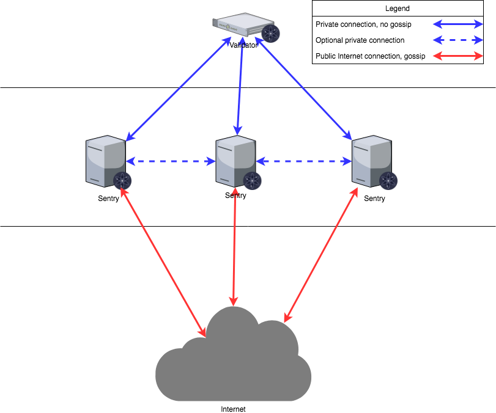

# 验证人

验证人负责在区块链中提交新的区块。
这些验证人通过广播包含每个验证人私钥签名的密码学签名的“投票”来参与共识协议。

一些权益证明共识算法旨在创建一个“完全”分散的系统，所有利益相关者（即使那些不总是在线的人）都参与区块的提交。
Tendermint对区块创建有不同的方法。验证人需要在线，并且验证人集合是通过某个外部过程进行权限控制/策划的。
权益证明不是必需的，但可以在Tendermint共识之上实现。也就是说，验证人可能需要在链上、链下或根本不需要发布任何抵押品。

验证人拥有一个密码学密钥对和一个关联的“投票权”。投票权不需要相同。

## 成为验证人

有两种方式成为验证人。

1. 他们可以在[创世状态](./using-tendermint.md#genesis)中预先设定。
2. ABCI应用程序通过对现有验证人集合的更改来响应EndBlock消息。

## 配置验证人

在配置验证人时，有无数种方法可以配置您的设置。本指南旨在展示其中一种方法，即哨兵节点设计。此设计主要用于防止DDOS攻击。

### 网络布局

该图基于AWS，其他云提供商将有类似的解决方案来设计解决方案。运行节点不限于云提供商，您也可以在裸机系统上运行节点。无论您决定选择哪种设置，架构都将是相同的。

所提议的网络图类似于企业环境中的经典后端/前端服务分离。在这种情况下，“后端”是验证人在数据中心的私有网络。数据中心网络可能涉及多个子网、防火墙和冗余设备，这在此图中没有详细说明。重要的是，数据中心允许与所选择的云环境直接连接。亚马逊AWS有“Direct Connect”，而Google Cloud有“Partner Interconnect”。这是与云提供商的专用连接（通常直接连接到您在其中一个区域的虚拟私有云实例）。

所有哨兵节点（即“前端”）通过这个私有连接与验证节点连接。验证节点没有公共IP地址来提供其服务。

亚马逊在一个区域内有多个可用区。也可以在其他区域安装哨兵节点。在这种情况下，第二个、第三个以及更多的区域需要与验证节点建立私有连接。这可以通过VPC Peering（在Google Cloud中称为“VPC网络对等连接”）来实现。在这种情况下，第二个、第三个以及更多的区域的哨兵节点将被定向到第一个区域，并通过直接连接到数据中心，到达验证节点。

一个更持久的解决方案（在图表中没有详细说明）是从数据中心到不同区域建立多个直接连接。这样就不需要强制使用VPC Peering，尽管对于哨兵节点仍然有益。这可以克服依赖于一个区域的风险，但成本更高。

### 本地配置

验证节点只会与提供的哨兵节点进行通信，哨兵节点通过一个秘密连接与验证节点通信，而与网络的其余部分通过正常连接进行通信。哨兵节点也可以相互通信。

在初始化节点时，`config.toml`中可能需要修改的五个参数如下：

- `pex:` 布尔值。这个参数用于打开或关闭节点的对等交换反应器。当`pex=false`时，只有`persistent_peers`列表可用于连接。
- `persistent_peers:` 逗号分隔的`nodeID@ip:port`值的列表，定义了一组预期始终在线的对等节点。这在首次启动时是必需的，因为通过设置`pex=false`，节点将无法加入网络。
- `unconditional_peer_ids:` 逗号分隔的nodeID列表。无论入站和出站对等节点的限制如何，这些节点都将被连接。这对于哨兵节点拥有完整的地址簿非常有用。
- `private_peer_ids:` 逗号分隔的nodeID列表。这些节点不会被传播到网络中。这是一个重要的字段，因为您不希望将验证节点的IP地址传播到网络中。
- `addr_book_strict:` 布尔值。默认情况下，具有可路由地址的节点将被视为可连接的节点。如果关闭此设置（false），则可以将非可路由的IP地址（例如私有网络中的地址）添加到地址簿中。
- `double_sign_check_height` int64高度。在加入共识之前，要回溯多少个块来检查节点的共识投票的存在。当非零时，如果同一个共识密钥在最后{double_sign_check_height}个块上被用于签名，则节点将在重新启动时发生panic。因此，验证者应该停止状态机，等待一些块，然后重新启动状态机以避免panic。

#### 验证节点配置

| 配置选项                  | 设置                        |
| ------------------------ | -------------------------- |
| pex                      | false                      |
| persistent_peers         | 哨兵节点列表              |
| private_peer_ids         | 无                         |
| unconditional_peer_ids   | 可选的哨兵节点ID           |
| addr_book_strict         | false                      |
| double_sign_check_height | 10                         |

验证节点应设置`pex=false`，以便不向整个网络传播信息。持久化节点应设置为您的哨兵节点。验证节点不需要隐藏其与之通信的对等节点，因此私有对等节点可以留空。对于验证节点来说，设置无条件对等节点是可选的，因为它们不需要完整的地址簿。

#### 哨兵节点配置

| 配置选项                | 设置                                          |
| ---------------------- | --------------------------------------------- |
| pex                    | true                                          |
| persistent_peers       | 验证节点，可选的其他哨兵节点                   |
| private_peer_ids       | 验证节点ID                                    |
| unconditional_peer_ids | 验证节点ID，可选的其他哨兵节点ID                |
| addr_book_strict       | false                                         |

哨兵节点应能够与整个网络通信，因此`pex=true`。哨兵节点的持久化节点将是验证节点，以及可选的其他哨兵节点。哨兵节点应确保不向网络传播验证节点的IP地址，为此，您必须将验证节点的节点ID作为私有对等节点。无条件对等节点将是验证节点ID，以及可选的其他哨兵节点。

> 注意：在设置节点时，请不要忘记保护节点的防火墙。

更多信息可以在以下链接找到：

- <https://kb.certus.one/>
- <https://forum.cosmos.network/t/sentry-node-architecture-overview/454>

### 验证节点密钥

保护验证人的共识密钥是设计设置时最重要的因素。验证人在创建节点时获得的密钥称为共识密钥，它必须始终在线以便对区块进行投票。**不建议**仅将私钥保存在默认的 JSON 文件（`priv_validator_key.json`）中。幸运的是，[Interchain Foundation](https://interchain.io/) 与一个团队合作构建了一个用于验证人的密钥管理服务器。您可以在[这里](https://github.com/iqlusioninc/tmkms)找到有关如何使用它的文档，它在生产中被广泛使用。您不仅限于使用此工具，还可以使用[HSMs](https://safenet.gemalto.com/data-encryption/hardware-security-modules-hsms/)，但没有推荐的 HSM。

目前 Tendermint 使用广泛支持的[Ed25519](https://ed25519.cr.yp.to/)密钥，该密钥在安全领域得到广泛应用，包括 HSMs。

## 提交区块

> **+2/3 表示 "超过 2/3"**

当+2/3的验证人集合在同一`round`上对该区块进行[预提交投票](https://github.com/tendermint/spec/blob/953523c3cb99fdb8c8f7a2d21e3a99094279e9de/spec/blockchain/blockchain.md#vote)时，该区块被提交。+2/3的预提交投票集合称为[_commit_](https://github.com/tendermint/spec/blob/953523c3cb99fdb8c8f7a2d21e3a99094279e9de/spec/blockchain/blockchain.md#commit)。虽然任何+2/3的预提交投票集合都可以作为验证，但规范的提交将包含在下一个区块中（参见[LastCommit](https://github.com/tendermint/spec/blob/953523c3cb99fdb8c8f7a2d21e3a99094279e9de/spec/blockchain/blockchain.md#lastcommit)）。

---
order: 6
---

# Validators

Validators are responsible for committing new blocks in the blockchain.
These validators participate in the consensus protocol by broadcasting
_votes_ which contain cryptographic signatures signed by each
validator's private key.

Some Proof-of-Stake consensus algorithms aim to create a "completely"
decentralized system where all stakeholders (even those who are not
always available online) participate in the committing of blocks.
Tendermint has a different approach to block creation. Validators are
expected to be online, and the set of validators is permissioned/curated
by some external process. Proof-of-stake is not required, but can be
implemented on top of Tendermint consensus. That is, validators may be
required to post collateral on-chain, off-chain, or may not be required
to post any collateral at all.

Validators have a cryptographic key-pair and an associated amount of
"voting power". Voting power need not be the same.

## Becoming a Validator

There are two ways to become validator.

1. They can be pre-established in the [genesis state](./using-tendermint.md#genesis)
2. The ABCI app responds to the EndBlock message with changes to the
   existing validator set.

## Setting up a Validator

When setting up a validator there are countless ways to configure your setup. This guide is aimed at showing one of them, the sentry node design. This design is mainly for DDOS prevention.

### Network Layout

The diagram is based on AWS, other cloud providers will have similar solutions to design a solution. Running nodes is not limited to cloud providers, you can run nodes on bare metal systems as well. The architecture will be the same no matter which setup you decide to go with.

The proposed network diagram is similar to the classical backend/frontend separation of services in a corporate environment. The “backend” in this case is the private network of the validator in the data center. The data center network might involve multiple subnets, firewalls and redundancy devices, which is not detailed on this diagram. The important point is that the data center allows direct connectivity to the chosen cloud environment. Amazon AWS has “Direct Connect”, while Google Cloud has “Partner Interconnect”. This is a dedicated connection to the cloud provider (usually directly to your virtual private cloud instance in one of the regions).

All sentry nodes (the “frontend”) connect to the validator using this private connection. The validator does not have a public IP address to provide its services.

Amazon has multiple availability zones within a region. One can install sentry nodes in other regions too. In this case the second, third and further regions need to have a private connection to the validator node. This can be achieved by VPC Peering (“VPC Network Peering” in Google Cloud). In this case, the second, third and further region sentry nodes will be directed to the first region and through the direct connect to the data center, arriving to the validator.

A more persistent solution (not detailed on the diagram) is to have multiple direct connections to different regions from the data center. This way VPC Peering is not mandatory, although still beneficial for the sentry nodes. This overcomes the risk of depending on one region. It is more costly.

### Local Configuration

The validator will only talk to the sentry that are provided, the sentry nodes will communicate to the validator via a secret connection and the rest of the network through a normal connection. The sentry nodes do have the option of communicating with each other as well.

When initializing nodes there are five parameters in the `config.toml` that may need to be altered.

- `pex:` boolean. This turns the peer exchange reactor on or off for a node. When `pex=false`, only the `persistent_peers` list is available for connection.
- `persistent_peers:` a comma separated list of `nodeID@ip:port` values that define a list of peers that are expected to be online at all times. This is necessary at first startup because by setting `pex=false` the node will not be able to join the network.
- `unconditional_peer_ids:` comma separated list of nodeID's. These nodes will be connected to no matter the limits of inbound and outbound peers. This is useful for when sentry nodes have full address books.
- `private_peer_ids:` comma separated list of nodeID's. These nodes will not be gossiped to the network. This is an important field as you do not want your validator IP gossiped to the network.
- `addr_book_strict:` boolean. By default nodes with a routable address will be considered for connection. If this setting is turned off (false), non-routable IP addresses, like addresses in a private network can be added to the address book.
- `double_sign_check_height` int64 height.  How many blocks to look back to check existence of the node's consensus votes before joining consensus When non-zero, the node will panic upon restart if the same consensus key was used to sign {double_sign_check_height} last blocks. So, validators should stop the state machine, wait for some blocks, and then restart the state machine to avoid panic.

#### Validator Node Configuration

| Config Option            | Setting                    |
| ------------------------ | -------------------------- |
| pex                      | false                      |
| persistent_peers         | list of sentry nodes       |
| private_peer_ids         | none                       |
| unconditional_peer_ids   | optionally sentry node IDs |
| addr_book_strict         | false                      |
| double_sign_check_height | 10                         |

The validator node should have `pex=false` so it does not gossip to the entire network. The persistent peers will be your sentry nodes. Private peers can be left empty as the validator is not trying to hide who it is communicating with. Setting unconditional peers is optional for a validator because they will not have a full address books.

#### Sentry Node Configuration

| Config Option          | Setting                                       |
| ---------------------- | --------------------------------------------- |
| pex                    | true                                          |
| persistent_peers       | validator node, optionally other sentry nodes |
| private_peer_ids       | validator node ID                             |
| unconditional_peer_ids | validator node ID, optionally sentry node IDs |
| addr_book_strict       | false                                         |

The sentry nodes should be able to talk to the entire network hence why `pex=true`. The persistent peers of a sentry node will be the validator, and optionally other sentry nodes. The sentry nodes should make sure that they do not gossip the validator's ip, to do this you must put the validators nodeID as a private peer. The unconditional peer IDs will be the validator ID and optionally other sentry nodes.

> Note: Do not forget to secure your node's firewalls when setting them up.

More Information can be found at these links:

- <https://kb.certus.one/>
- <https://forum.cosmos.network/t/sentry-node-architecture-overview/454>

### Validator keys

Protecting a validator's consensus key is the most important factor to take in when designing your setup. The key that a validator is given upon creation of the node is called a consensus key, it has to be online at all times in order to vote on blocks. It is **not recommended** to merely hold your private key in the default json file (`priv_validator_key.json`). Fortunately, the [Interchain Foundation](https://interchain.io/) has worked with a team to build a key management server for validators. You can find documentation on how to use it [here](https://github.com/iqlusioninc/tmkms), it is used extensively in production. You are not limited to using this tool, there are also [HSMs](https://safenet.gemalto.com/data-encryption/hardware-security-modules-hsms/), there is not a recommended HSM.

Currently Tendermint uses [Ed25519](https://ed25519.cr.yp.to/) keys which are widely supported across the security sector and HSMs.

## Committing a Block

> **+2/3 is short for "more than 2/3"**

A block is committed when +2/3 of the validator set sign [precommit
votes](https://github.com/tendermint/spec/blob/953523c3cb99fdb8c8f7a2d21e3a99094279e9de/spec/blockchain/blockchain.md#vote) for that block at the same `round`.
The +2/3 set of precommit votes is called a
[_commit_](https://github.com/tendermint/spec/blob/953523c3cb99fdb8c8f7a2d21e3a99094279e9de/spec/blockchain/blockchain.md#commit). While any +2/3 set of
precommits for the same block at the same height&round can serve as
validation, the canonical commit is included in the next block (see
[LastCommit](https://github.com/tendermint/spec/blob/953523c3cb99fdb8c8f7a2d21e3a99094279e9de/spec/blockchain/blockchain.md#lastcommit)).
